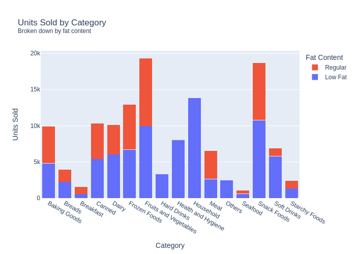
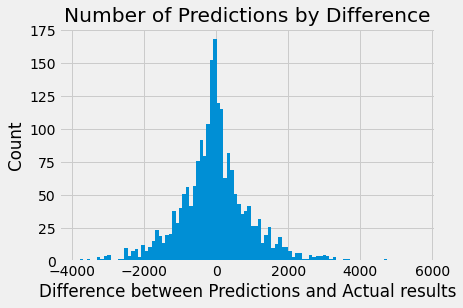

# Predict Item Sales to Drive Profit
## Machine Learning Model Transforming Item Data into Sales

**Author**: Brian Lafferty

### Business problem:

Can raw descriptive product data be turned into a predictive model for item sales with Machine Learning?

### Data
Over 8500 item oberavtions from many different store outlets. Data included information about the product (weight, fat content, category, etc.) and sales establishment infomation (size, type, etc.).

## Methods
- Data cleaned and prepared using imputing and category standaraization strategies
- Visualization of data to explore and find underlying trends
- Analyized data using multiple machine learning models to optimize results

## Model
The machine learning model selected for this project was a regression tree. This model preformed best with the data when compared with a linear regression model. After tuning hyperparameters of the regreesion tree, it produced a R^2 value above 0.996 on the test data.

## Results

> Identified categories with opportunity for growth and product segmentation.

#### Key Heatmap Correlations

> Using provided data I created an additional column of Unit_Sold. This information improves data analysis and model performance.

#### Regression Tree Metrics

> - The Mean Squared Error is 45.38. This shows that the models average error is $45.38 per item prediction. The average value of Item_Outlet_Sales is $2181.29, so the error represents approximately 2% of the total sales.
> - The model can predict the Item_Outlet_Sales target within $100 dollars 88.64% of the time.
> - The model had 7 predictions that were over $500 off of the actual value. That represents approximately .5% of the predictions.
> - 50% of the values had predictions less than $21 from the actual value.

## Recommendations:
- This regression tree model should be used to forecast sales for potential new products.
- Breakfast category should be expanded to increase market share.
- Location of stores matter. Future stores should be in Outlet_Location_Type of Tier 2 or above.

## Limitations & Next Steps
The regression tree model did have 7 predictions that were beyond $500 with a maximum of $1807 away from actual results. As I continue to learn more about Machine Learning, I will conintue to improve this analysis and strive to make the results even better.

### For further information

For any additional questions, please contact me on [LinkedIn](https://www.linkedin.com/in/brian-lafferty). 
